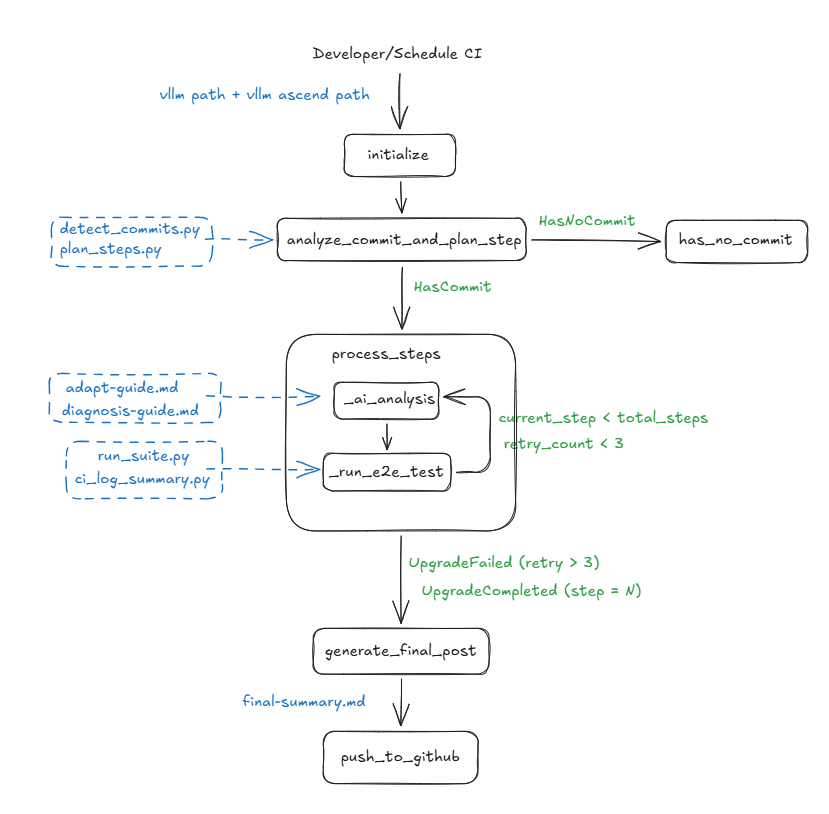

# Upstream Main2Main Upgrade Flow

Automate vllm-ascend's [main2main upgrade](docs/guide.md) against upstream vLLM.

Each time vLLM's `main` advances, vllm-ascend must catch up: bump the recorded
upstream commit, adapt any broken interfaces, and re-run e2e CI. This project
drives that whole loop:

- detect the commit gap, plan it into bite-sized steps
- for every step, run an `opencode` AI agent to adapt the code and a
  deterministic pre-CI check
- run real NPU e2e tests, retry on failure (up to 3×)
- when everything passes, push a branch and open a PR

Full walkthrough lives in [`docs/guide.md`](docs/guide.md); this README only
covers how to install and run.



## Requirements

- Python 3.10–3.13
- [`opencode`](https://opencode.ai) CLI on `$PATH` (used as the AI adapter)
- `git`, plus local checkouts of `vllm` and `vllm-ascend` (or HTTPS URLs to
  clone)
- For real e2e tests: a host with Ascend NPUs reachable over SSH, with a
  prepared Docker container
- For automated PRs: [`gh`](https://cli.github.com/) logged in

## Install

```bash
pip install -e .
```

(`uv sync` also works if you use [`uv`](https://docs.astral.sh/uv/); the repo
already ships a `uv.lock`.)

## Run

```bash
python main.py \
  --vllm-path        /path/to/vllm \
  --vllm-ascend-path /path/to/vllm-ascend \
  [--target-commit   <40-char SHA>]
```

- Both paths may be local git checkouts **or** HTTPS / SSH git URLs — URLs are
  auto-cloned into `workspace/repos/`.
- `--target-commit` is optional; defaults to vllm `HEAD`.
- Each run wipes and recreates `workspace/`, so back it up if you need the
  artifacts from a previous run.

CLI flags can also be supplied via env vars: `VLLM_PATH`, `VLLM_ASCEND_PATH`,
`VLLM_TARGET_COMMIT` (CLI wins).

### Common variations

```bash
# Clone both repos from GitHub, target vllm HEAD
python main.py \
  --vllm-path        https://github.com/vllm-project/vllm.git \
  --vllm-ascend-path https://github.com/vllm-project/vllm-ascend.git

# Dry-run plumbing: skip both opencode and NPU tests
SKIP_AI_ANALYSIS=true SKIP_E2E_TEST=true python main.py \
  --vllm-path /path/to/vllm --vllm-ascend-path /path/to/vllm-ascend

# Run e2e tests on a remote NPU box via SSH + docker exec
MAIN2MAIN_REMOTE_HOST=root@10.0.0.10 \
MAIN2MAIN_REMOTE_CONTAINER=vllm-ascend-ci \
python main.py --vllm-path ... --vllm-ascend-path ...

# Auto-push a branch and open a PR after a successful run
PUSH_TO_GITHUB=true GITHUB_REPO=vllm-project/vllm-ascend \
python main.py --vllm-path ... --vllm-ascend-path ...
```

### Environment variables

| Variable | Purpose | Default |
|---|---|---|
| `VLLM_PATH` | vllm repo (path or URL) | `workspace/repos/vllm` |
| `VLLM_ASCEND_PATH` | vllm-ascend repo (path or URL) | `workspace/repos/vllm-ascend` |
| `VLLM_TARGET_COMMIT` | target vllm commit SHA | vllm `HEAD` |
| `SKIP_AI_ANALYSIS` | skip the opencode agent, only run deterministic steps | `false` |
| `SKIP_E2E_TEST` | skip the NPU e2e tests, treat as passed | `false` |
| `PUSH_TO_GITHUB` | open a PR after success | `false` |
| `GITHUB_REPO` | PR target, `owner/name` | — |
| `MAIN2MAIN_REMOTE_HOST` | SSH host running the NPU container | — |
| `MAIN2MAIN_REMOTE_CONTAINER` | Docker container name on that host | — |

## Outputs

Everything lands under `workspace/` (recreated on every run):

```
workspace/
├── detect.json            # base / target commits, compat tag
├── steps.json             # full step plan
├── final_summary.md       # summary copied from the last successful step
├── final_target.patch     # cumulative vllm-ascend diff
└── steps/<step-id>/
    ├── upstream.patch     # this step's vllm diff
    ├── changed_files.txt
    ├── step_target.patch  # vllm-ascend diff for this step
    ├── step_summary.md    # AI-written summary
    ├── pre_ci_check.json  # deterministic pre-CI result
    ├── opencode.log       # opencode conversation log
    ├── opencode_raw.jsonl # raw event stream
    └── tests/
        ├── round-<n>-<suite>.log
        └── round-<n>-summary.json
```

## Project layout

```
main.py                    # CLI entrypoint
src/
├── flow.py              # Flow: nodes, routing, retry loop
├── utils.py             # filename constants + git helpers
├── agent/
│   ├── opencode_adapter.py   # spawns `opencode run`, parses JSONL events
│   └── prompt.md             # single-agent task prompt
├── reference/           # knowledge base the agent reads at runtime
│   ├── adapt-guide.md
│   ├── code-structure-guide.md
│   ├── diagnosis-guide.md
│   └── error-pattern-examples.md
└── scripts/             # deterministic helpers (no AI)
    ├── detect_commits.py
    ├── plan_steps.py
    ├── update_commit_reference.py
    ├── pre_ci_check.py
    ├── run_tests.py
    └── push_to_github.py
```

For a step-by-step explanation of every node and the per-step artifacts, see
[`docs/guide.md`](docs/guide.md). For conventions and gotchas that affect code
changes to this repo itself, see [`AGENTS.md`](AGENTS.md).
